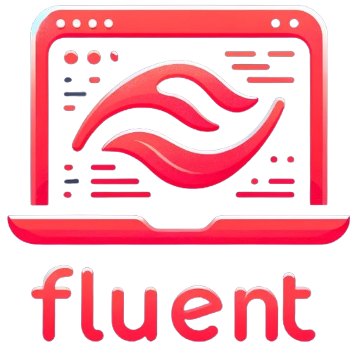

# Welcome to FluentCLI

<figure><figcaption></figcaption></figure>

Welcome to the official documentation for FluentCLI, a versatile command-line interface designed to interact with FlowiseAI, Langflow, and Webhook workflows. This documentation will guide you through the installation, configuration, and usage of FluentCLI.

### Table of Contents

1. Introduction
2. Installation
3. Configuration
4. Basic Usage
5. Advanced Commands
6. Outputs and Formats
7. Integration with Other Tools
8. Examples
9. Troubleshooting
10. Appendix

## Introduction

FluentCLI is a command-line tool that facilitates interactions with various AI engines and services, including FlowiseAI, Langflow, and Webhooks. By leveraging FluentCLI, users can easily send requests, upload files, and receive responses in different formats directly from the terminal.

#### Key Features

* **Easy Configuration:** Define multiple flows with customizable configurations.
* **Versatile Usage:** Supports multiple AI engines and services including FlowiseAI, Langflow, and Webhooks.
* **Rich Output Options:** Choose from various output formats, including JSON, markdown, and plain text.
* **File Uploads:** Upload files to endpoints seamlessly.
* **Integration:** Easily integrate with other tools and services in your workflow.

This documentation aims to cover all aspects of FluentCLI, from initial setup to advanced usage scenarios. Let's get started!

## Installation

To get started with FluentCLI, you must first install it. FluentCLI is written in Rust, so you'll need to have Rust installed on your system. Follow the steps below to install Rust and then FluentCLI.

#### Installing Rust

If you don't have Rust installed, you can install it using the following command:

```sh
curl --proto '=https' --tlsv1.2 -sSf https://sh.rustup.rs | sh
```

Follow the on-screen instructions to complete the installation. After installation, ensure Rust is correctly installed by running:

```sh
rustc --version
```

#### Installing FluentCLI

Clone the FluentCLI repository from GitHub and navigate to the project directory:

```sh
git clone https://github.com/njfio/fluent_cli.git
cd fluent_cli
```

Next, build and install FluentCLI using Cargo:

```sh
cargo install --path .
```

This command compiles the FluentCLI source code and installs the `fluent` command on your system.

#### Verifying the Installation

After installation, you can verify that FluentCLI is installed correctly by running:

```sh
fluent --version
```

You should see the version information of FluentCLI displayed in the terminal.

## Configuration

FluentCLI uses a configuration file to manage different flows and their settings. The configuration file is written in JSON format and must be placed in a directory specified by the `FLUENT_CLI_CONFIG_PATH` environment variable.

#### Setting Up the Configuration File

Create a JSON configuration file and set the `FLUENT_CLI_CONFIG_PATH` environment variable to the directory containing the file. Here's an example configuration file:

```json
[
  {
    "name": "LocalGoogleGeminiChain",
    "engine": "flowise",
    "protocol": "http",
    "hostname": "127.0.0.1",
    "port": 3000,
    "chat_id": "fbaa82fb-6312-4bbd-a841-bdcf2a8c2bba",
    "request_path": "/api/v1/prediction/",
    "sessionId": "AMBER_FLUENT_SESSION_ID_01",
    "bearer_token": "AMBER_REPO_CLOUD_FLUENT_DEMO_KEY",
    "overrideConfig": {
      "modelName": "gemini-1.5-pro-latest"
    },
    "tweaks": {},
    "timeout_ms": 50000
  },
  {
    "name": "LangFlowExample",
    "engine": "langflow",
    "protocol": "https",
    "hostname": "njfio-langflow-preview.hf.space",
    "port": 443,
    "request_path": "/api/v1/run/",
    "chat_id": "b711ccd8-fc6f-4faf-acf1-bf155dd29c92?",
    "bearer_token": "AMBER_REPO_CLOUD_FLUENT_DEMO_KEY",
    "input_value_key": "input_value",
    "sessionId": "",
    "output_type": "chat",
    "input_type": "chat",
    "overrideConfig": {},
    "tweaks": {},
    "timeout_ms": 50000
  }
]
```

#### Environment Variables

Set the `FLUENT_CLI_CONFIG_PATH` environment variable to the directory containing your configuration file:

```sh
export FLUENT_CLI_CONFIG_PATH=/path/to/config_directory
```

You can also add this line to your shell's configuration file (e.g., `.bashrc`, `.zshrc`) to make it persistent.

#### Configuration Fields

* **name:** The name of the flow.
* **engine:** The AI engine or service to be used (e.g., "flowise", "langflow").
* **protocol:** The protocol to use ("http" or "https").
* **hostname:** The hostname of the service.
* **port:** The port number of the service.
* **chat\_id:** The chat ID or endpoint identifier.
* **request\_path:** The request path for the service.
* **sessionId:** The session ID (can use environment variables prefixed with "AMBER\_").
* **bearer\_token:** The bearer token for authentication (can use environment variables prefixed with "AMBER\_").
* **overrideConfig:** Custom configuration overrides.
* **tweaks:** Additional configuration tweaks.
* **timeout\_ms:** Request timeout in milliseconds.

## Basic Usage

Once you have installed and configured FluentCLI, you can start using it to interact with various AI engines and services.

#### Sending a Simple Request

To send a request to a configured flow, use the following command:

```sh
fluent <flowname> <request>
```

For example:

```sh
fluent LocalGoogleGeminiChain "What is the weather today?"
```

This command sends the request "What is the weather today?" to the flow named "LocalGoogleGeminiChain".

#### Adding Context

You can provide additional context to your request using the `--context` flag or by piping input from a file or stdin.

**Using the `--context` flag:**

```sh
fluent LocalGoogleGeminiChain "Tell me a joke" --context "Humor context"
```

**Piping input from a file:**

```sh
cat context.txt | fluent LocalGoogleGeminiChain "Tell me a joke"
```

#### Uploading Files

FluentCLI allows you to upload files as part of your request using the `--upload-image-path` flag:

```sh
fluent LocalGoogleGeminiChain "Analyze this image" --upload-image-path /path/to/image.png
```

#### Specifying Output Formats

FluentCLI supports multiple output formats such as markdown, plain text, and JSON.

**Markdown output:**

```sh
fluent LocalGoogleGeminiChain "Show me the documentation" --markdown-output
```

**Extracting code blocks:**

```sh
fluent LocalGoogleGeminiChain "Provide a code example" --parse-code-output
```

**Full JSON output:**

```sh
fluent LocalGoogleGeminiChain "Give me detailed output" --full-output
```

## Advanced Commands

FluentCLI offers several advanced commands and flags to customize your interactions and workflows.

#### Overriding Configuration

You can override configuration settings directly from the command line using the `--override` flag:

```sh
fluent LocalGoogleGeminiChain "What is the weather today?" --override modelName=gpt-3.5-turbo
```

This command overrides the `modelName` setting for the specified request.

#### Generating Autocomplete Scripts

FluentCLI can generate autocomplete scripts for Bash and Fig.

**Generating a Bash autocomplete script:**

```sh
fluent --generate-autocomplete
```

**Generating a Fig autocomplete script:**

```sh
fluent --generate-fig-autocomplete
```

#### Upserting Data

You can upsert data using the `--upsert-no-upload` or `--upsert-with-upload` flags.

**Upserting without file upload:**

```sh
fluent LocalGoogleGeminiChain --upsert-no-upload
```

**Upserting with file upload:**

```sh
fluent LocalGoogleGeminiChain --upsert-with-upload /path/to/file.txt
```

## Outputs and Formats

FluentCLI provides flexible output options to suit different use cases.

#### Default Output

By default, FluentCLI prints the response text to the terminal:

```sh
fluent LocalGoogleGeminiChain "Tell me a joke"
```

#### Markdown Output

To format the response in markdown, use the `--markdown-output` flag:

```sh
fluent LocalGoogleGeminiChain "Show me the documentation" --markdown-output
```

Example markdown output:

```markdown
# Documentation
Here is the documentation you requested.

## Section 1

...

## Section 2

...

```

#### Extracting Code Blocks

To extract and display only the code blocks from the response, use the `--parse-code-output` flag:

```sh
fluent LocalGoogleGeminiChain "Provide a code example" --parse-code-output
```

Example extracted code:

```rust
fn main() {
    println!("Hello, world!");
}
```

#### Full JSON Output

To view the full JSON response, use the `--full-output` flag:

```sh
fluent LocalGoogleGeminiChain "Give me detailed output" --full-output
```

Example JSON output:

```json
{
  "response_text": "Here is the detailed output...",
  "question": "What is the weather today?",
  "chat_id": "fbaa82fb-6312-4bbd-a841-bdcf2a8c2bba",
  "session_id": "AMBER_FLUENT_SESSION_ID_01",
  "memory_type": "short_term",
  "source_documents": [
    {
      "page_content": "Weather data...",
      "metadata": {
        "source": "weather_api",
        "repository": "weather_repo",
        "branch": "main",
        "loc": {
          "lines": {
            "from": 1,
            "to": 10
          }
        }
      }
    }
  ]
}
```

## Integration with Other Tools

FluentCLI can be integrated with other tools and services to enhance your workflow.

#### Integrating with Scripts

You can use FluentCLI in shell scripts to automate tasks:

```sh
#!/bin/bash

# Define the flow and request
FLOW="LocalGoogleGeminiChain"
REQUEST="What is the weather today?"

# Send the request using FluentCLI
RESPONSE=$(fluent $FLOW "$REQUEST" --full-output)

# Process the response
echo "Response: $RESPONSE"
```

#### Piping Data

FluentCLI supports piping data to and from other commands:

```sh
# Send a request and pipe the response to jq for processing
fluent LocalGoogleGeminiChain "What is the weather today?" --full-output | jq '.'
```

#### Scheduling Tasks

You can use FluentCLI with cron to schedule tasks:

```sh
# Open the crontab file for editing
crontab -e

# Schedule a task to run FluentCLI every day at 9 AM
0 9 * * * fluent LocalGoogleGeminiChain "What is the weather today?" --full-output >> /path/to/output.log 2>&1
```

## Examples

Here are some examples to help you get started with FluentCLI.

#### Example 1: Simple Request

Send a simple request to the "LocalGoogleGeminiChain" flow:

```sh
fluent LocalGoogleGeminiChain "Tell me a joke"
```

#### Example 2: Request with Context

Send a request with additional context:

```sh
fluent LocalGoogleGeminiChain "Tell me a joke" --context "Humor context"
```

#### Example 3: File Upload

Upload an image file as part of the request:

```sh
fluent LocalGoogleGeminiChain "Analyze this image" --upload-image-path /path/to/image.png
```

#### Example 4: Markdown Output

Get the response in markdown format:

```sh
fluent LocalGoogleGeminiChain "Show me the documentation" --markdown-output
```

#### Example 5: Extract Code Blocks

Extract and display only the code blocks:

```sh
fluent LocalGoogleGeminiChain "Provide a code example" --parse-code-output
```

## Troubleshooting

If you encounter issues while using FluentCLI, this section provides some troubleshooting tips.

#### Common Issues

* **Invalid configuration file path:** Ensure that the `FLUENT_CLI_CONFIG_PATH` environment variable is set correctly.
* **Missing dependencies:** Ensure that all required dependencies are installed, including Rust.
* **Network issues:** Check network connectivity and ensure that the specified host and port are accessible.

#### Debugging

Enable debug logging to get more detailed output:

```sh
export RUST_LOG=debug
fluent LocalGoogleGeminiChain "What is the weather today?"
```

#### Error Messages

If you encounter error messages, refer to the detailed error output and logs to diagnose the issue.

## Appendix

#### JSON Configuration Example

Here is a complete example of a JSON configuration file:

```json
[
  {
    "name": "LocalGoogleGeminiChain",
    "engine": "flowise",
    "protocol": "http",
    "hostname": "127.0.0.1",
    "port": 3000,
    "chat_id": "fbaa82fb-6312-4bbd-a841-bdcf2a8c2bba",
    "request_path": "/api/v1/prediction/",
    "sessionId": "AMBER_FLUENT_SESSION_ID_01",
    "bearer_token": "AMBER_REPO_CLOUD_FLUENT_DEMO_KEY",
    "overrideConfig": {
      "modelName": "gemini-1.5-pro-latest"
    },
    "tweaks": {},
    "timeout_ms": 50000
  },
  {
    "name": "LangFlowExample",
    "engine": "langflow",
    "protocol": "https",
    "hostname": "njfio-langflow-preview.hf.space",
    "port": 443,
    "request_path": "/api/v1/run/",
    "chat_id": "b711ccd8-fc6f-4faf-acf1-bf155dd29c92?",
    "bearer_token": "AMBER_REPO_CLOUD_FLUENT_DEMO_KEY",
    "input_value_key": "input_value",
    "sessionId": "",
    "output_type": "chat",
    "input_type": "chat",
    "overrideConfig": {},
    "tweaks": {},
    "timeout_ms": 50000
  }
]
```

#### Environment Variables

Here are the environment variables used in FluentCLI:

* **FLUENT\_CLI\_CONFIG\_PATH:** Path to the directory containing the configuration file.
* **RUST\_LOG:** Set to `debug` to enable debug logging.

This concludes the documentation for FluentCLI. We hope you find it helpful and informative. If you have any questions or need further assistance, please refer to the troubleshooting section or contact support. Used Tools:

